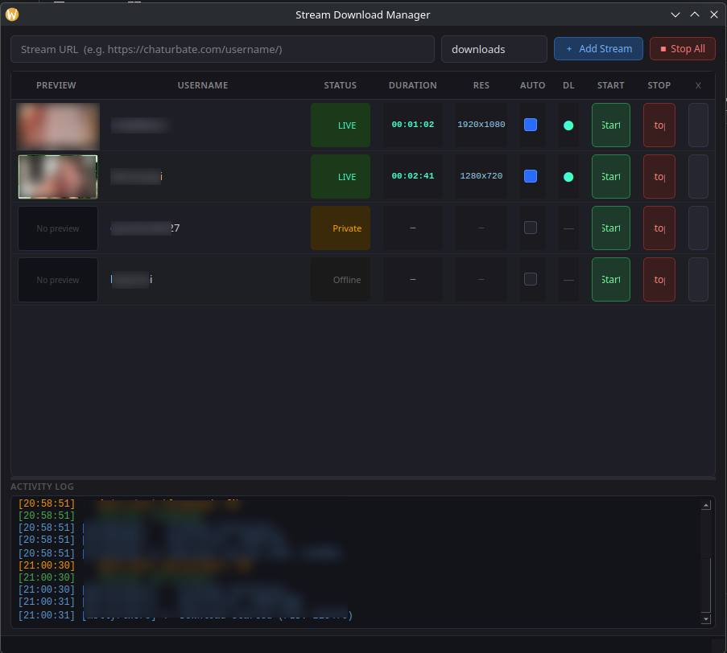

# Chaturbate Stream Monitor & Downloader (GUI Tool)

A Python + PySide6 application for monitoring live streams, capturing previews, and downloading active streams using `yt-dlp` and `ffmpeg`.

The tool tracks multiple stream URLs, detects live status, shows real-time previews, and can automatically download active streams.

---

## ✨ Features

- Live stream status checker (yt-dlp based)
- Real-time status updates (online / offline / private / away / error)
- Automatic preview capture using ffmpeg
- Stream downloading via yt-dlp
- Download progress tracking
- Rate limiting to avoid blocking
- Multi-threaded workers (GUI stays responsive)
- Auto-retry on status changes (offline → online)

---
## 📸 Preview

The application showing multiple stream states:


---

## 📦 Requirements

- Python 3.10+
- ffmpeg installed and available in PATH
- yt-dlp installed and available in PATH

---

## 🐍 Python dependencies

```bash
pip install PySide6 psutil
```

---

## 🚀 Usage

Run the application:

```bash
python stream_downloader.py
```

---

## 🔐 Authentication (optional)

Some streams may require authentication depending on access restrictions (e.g. private or age-restricted content).

If a stream appears offline but is known to be live, enabling cookies may help:

- Enable cookie support in the configuration:
  - `USE_COOKIES = True`
- Select browser source if needed:
  - `BROWSER = "firefox"`

Supported browsers:
`firefox`, `chrome`, `chromium`, `edge`, `brave`, `opera`, `safari`

---

## ⚠️ Known limitations

- Session-based stream URLs may expire during long downloads
- Some streams may appear “online” but still require authentication for download access
- HLS/DASH stream formats vary between providers, which may affect stability
