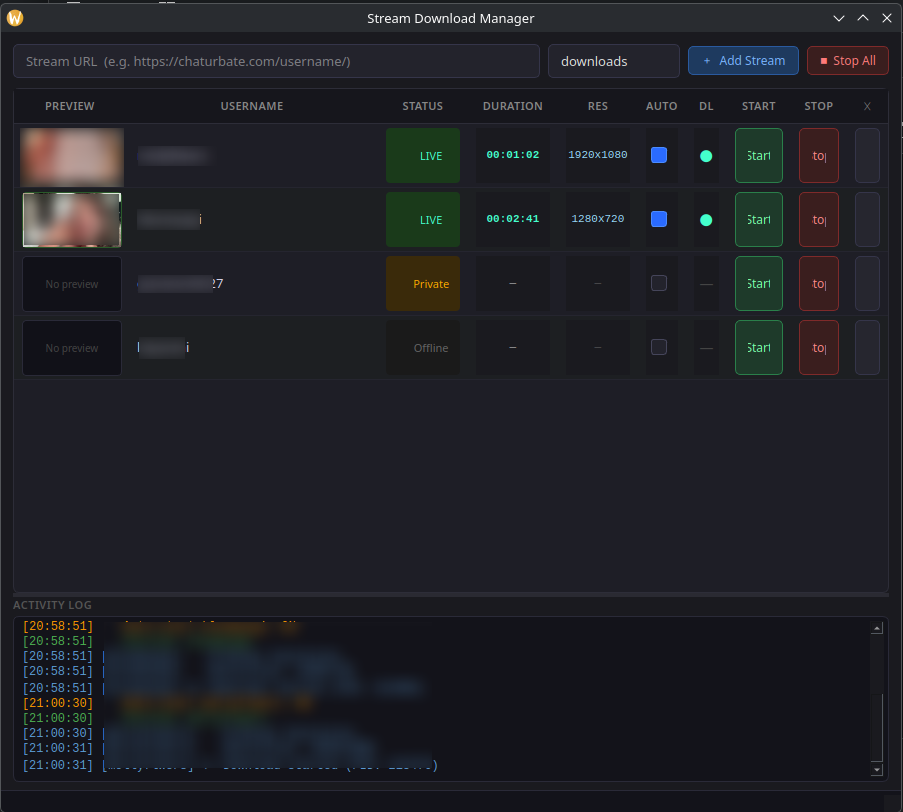

# Chaturbate Stream Monitor & Downloader (GUI Tool)

A Python + PySide6 application for monitoring live streams, capturing previews, and downloading active streams using `yt-dlp` and `ffmpeg`.

The tool tracks multiple stream URLs, detects live status, shows real-time previews, and can automatically download active streams.

[](https://github.com/Tazir709/stream-monitor/releases/latest)

---
### Tested on:
- Windows 10 / 11
- Fedora Linux (recent versions)
---

## ✨ Features

- Live stream status checker (yt-dlp based)
- Real-time status updates (online / offline / private / away / error)
- Automatic preview capture using ffmpeg
- Stream downloading via yt-dlp
- Download progress tracking
- Rate limiting to avoid blocking
- Multi-threaded workers (GUI stays responsive)
- Auto-retry on status changes (offline → online)

---
## 📸 Preview

The application showing multiple stream states:


---

## 📦 Requirements

- Python 3.10+
- ffmpeg installed and available in PATH
- yt-dlp installed and available in PATH

---

## 🐍 Python dependencies

```bash
pip install PySide6 psutil
```

---

## 🚀 Usage

Run the application:

```bash
python stream_manager.py
```

---

## 🔐 Authentication

Chaturbate has been tightening access controls over time, so in practice cookies are usually needed for the tool to work at all now — not just for private or age-restricted streams. If a stream appears offline but is known to be live, or checks/downloads fail outright, enable cookies first:

- `USE_COOKIES = True`
- `BROWSER = "firefox"` — set this to whichever browser you're actually logged into Chaturbate with

Supported browsers:
`firefox`, `chrome`, `chromium`, `edge`, `brave`, `opera`, `safari`

You can also set `USER_AGENT` to a real browser's user-agent string, ideally matching the browser your cookies came from. This has been needed on some platforms (macOS in particular) to avoid being blocked even with valid cookies. Leave it blank to use yt-dlp's default.

---

## ⚠️ Known limitations

- Session-based stream URLs may expire during long downloads
- Some streams may appear “online” but still require authentication for download access

## 📝 Changelog

### (August 2026)
- Added user-agent support for macOS compatibility (improves compatibility with some platforms)
- Improved filename format: `username YYYY-MM-DD HH_MM.mp4`
- Added smart fallback for resolution selection when preferred formats are unavailable
- Added adaptive stream checking: offline streams now use gradually longer check intervals to reduce unnecessary requests while still detecting new streams quickly
- Added auto-download protection: streams that repeatedly produce very short downloads are temporarily disabled to prevent restart loops
- Improved error handling and user feedback throughout the application
